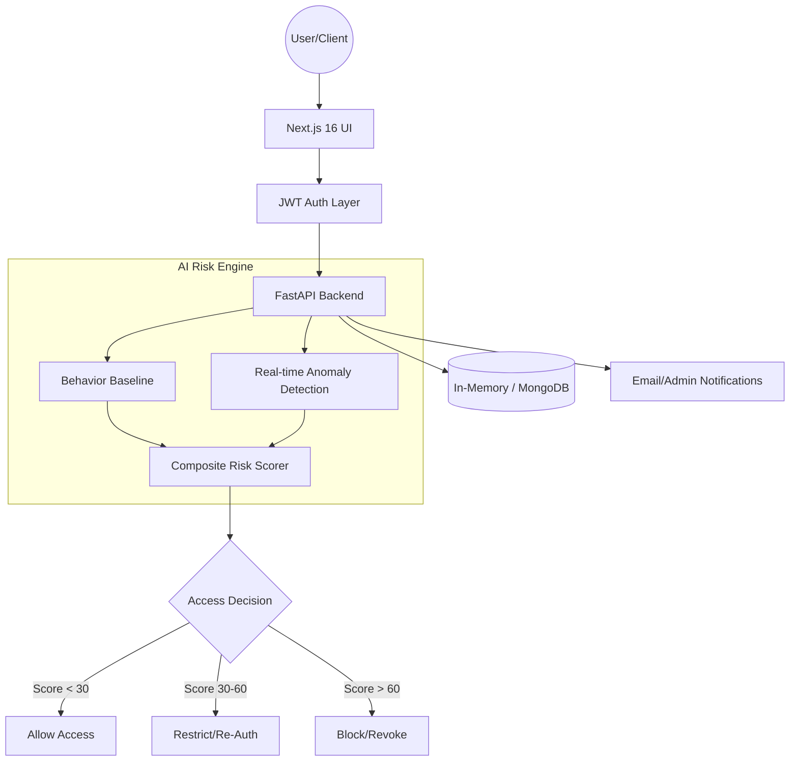

# Zero Trust Security Platform  🔐

**Next-Gen AI Security Operations Center (SOC) Intelligence**

Built by **Team CloudSentrix**
*   **Vannoor**
*   **Geetha**

---

## 🚩 The Problem
Traditional security models rely on static perimeters (firewalls, VPNs). However, in modern cloud environments:
1.  **Trust is over-extended:** Once inside, users often have broad access.
2.  **Alert Fatigue:** Security teams are overwhelmed by static alerts that lack context.
3.  **Credential Theft:** Traditional passwords are not enough to stop sophisticated identity-based attacks.
4.  **Behavioral Blindness:** Systems don't realize when a legitimate user starts acting like an attacker.

## 💡 Our Solution: The Zero Trust Platform
We built a **context-aware, AI-driven security ecosystem** that follows the core principle: **"Never Trust, Always Verify."**

Our platform continuously monitors user behavior and calculates a real-time **Risk Score (0-100)**. Based on this score, the system dynamically adjusts access levels:
*   **🟢 Low Risk (0-30):** Full access granted.
*   **🟡 Medium Risk (31-60):** User is flagged; re-authentication (MFA) or restricted access is triggered.
*   **🔴 High Risk (61-100):** Session is instantly revoked, and the user is blocked until an admin review.

---

## 🏗️ Architecture & Tech Stack

### High-Level Architecture


### Technology Stack
*   **Core Logic:** Python 3.11 + FastAPI (High performance, asynchronous)
*   **Frontend Aesthetics:** Next.js 16 (Turbopack), Tailwind CSS, Shadcn UI
*   **Database:** MongoDB Atlas (Production) / In-Memory (Hybrid Fallback)
*   **Cloud Infrastructure:** Google Cloud Platform (GCP)
    *   **Cloud Run:** Serverless container execution for zero-maintenance scaling.
    *   **Artifact Registry:** Secure storage for Docker images.
    *   **Cloud Build:** Automated CI/CD pipelines.

---

## 🛠️ How We Built This (Implementation Journey)

### 1. The Behavioral Risk Engine
We implemented a multi-factor risk calculator in `risk_engine.py` that evaluates:
- **Time Deviations:** Unexpected login hours (e.g., 3 AM).
- **Device/IP Profiling:** Detecting new network signatures or unknown machines.
- **Action Spikes:** Sudden surges in data downloads or service switches.
- **Brute Force Detection:** Monitoring failed login attempts before a successful one.

### 2. Solving Deployment Challenges
During deployment to **GCP Cloud Run**, we encountered and solved:
- **Python Environment Issues:** Fixed broken virtual environment paths by implementing a local-first setup.
- **Alpine Linux Compatibility:** Next.js standalone builds on Alpine required `libc6-compat` to bridge native library gaps.
- **Frontend-Backend Sync:** Injected dynamic Backend URLs into the Next.js build process via `--build-arg` in Cloud Build.

### 3. AI-Driven Insights
The system doesn't just block users; it explains **why**. Using human-readable logic, the `_explain` module breaks down critical risk factors for SOC analysts, reducing investigation time.

---

## 🚀 Deployment Commands (GCP)

To deploy the platform yourself, follow Team CloudSentrix's verified workflow:

```powershell
# 1. Build and Push Backend
gcloud builds submit --config backend/cloudbuild.yaml --substitutions "_IMAGE_NAME=YOUR_BACKEND_IMAGE_URL" ./backend

# 2. Deploy Backend to Cloud Run
gcloud run deploy zero-trust-backend --image YOUR_BACKEND_IMAGE_URL --allow-unauthenticated

# 3. Build Frontend (Injecting Backend URL)
gcloud builds submit --config cloudbuild-frontend.yaml --substitutions "_IMAGE_NAME=YOUR_FRONTEND_IMAGE_URL,_API_URL=YOUR_BACKEND_URL" .

# 4. Deploy Frontend
gcloud run deploy zero-trust-frontend --image YOUR_FRONTEND_IMAGE_URL --allow-unauthenticated
```

---

## 👥 The Team: CloudSentrix
This project was conceptualized and developed by:
*   **Vannoor**: Lead Architecture & Security Engineering.
*   **Geetha**: Frontend Excellence & Data Visualization.

---
**Zero Trust Security Platform** | *Never Trust, Always Verify.*
